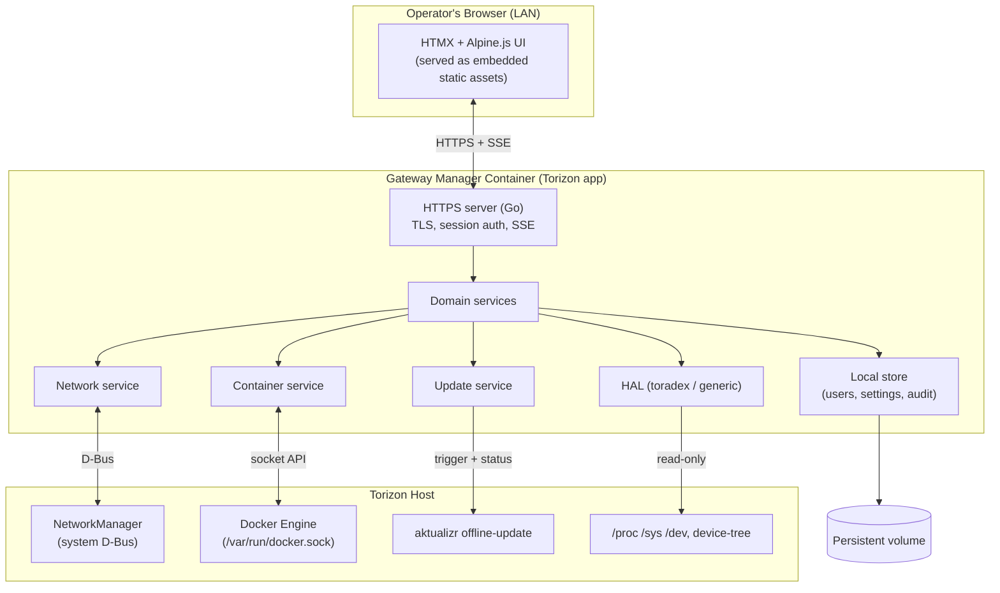

# Torizon Web Gateway — Architecture & Specification

> Working title: **Torizon Gateway Manager** (product context: **Toradex Zinnia**, Toradex's first gateway product).
> Status: **Draft v0.1** — architecture agreed, pending confirmation of open decisions (see §16).
> Owner: Stefano Viola.

---

## 1. Overview & goals

A **web-based device management application** that runs *on* the Torizon device and lets an operator, from a browser on the local network, inspect and manage the board without a shell.

Primary goals:

- **Hardware-agnostic / Torizon-native.** Targets the Verdin family first (Zinnia) but must run on any Toradex SoM running Torizon OS, and degrade gracefully elsewhere. No hardware-specific assumptions baked into feature logic.
- **Self-contained & offline-first.** Full functionality with no internet connection. No external CDNs, no cloud dependency for core features.
- **Single deployable artifact.** Ships as one Torizon application (docker-compose), one container, one Go binary with the UI embedded.
- **Product-grade from day one.** Real authentication, HTTPS, signed updates, safe network changes with rollback.

### Core capabilities (MVP)

| # | Feature | First release |
|---|---------|---------------|
| 1 | **System / board info** — read-only dashboard | ✅ |
| 2 | **Network configuration** — Ethernet/WiFi/DNS via NetworkManager | ✅ |
| 3 | **Container management** — list/status/logs, start/stop/restart | ✅ |
| 4 | **Offline updates** — Torizon Secure Offline Updates (Lockbox) | ✅ |

---

## 2. Non-goals (for MVP)

- Fleet / multi-device management (that is Toradex Cloud's job — this app manages **one** device).
- Cloud connectivity, telemetry export, or remote access tunneling.
- A general-purpose container *authoring* tool (no image building on-device).
- User/role management beyond a single admin account (RBAC is a later phase).
- Internationalization (English only for MVP; strings externalized to allow it later).

---

## 3. Platform assumptions & hardware abstraction

### Assumptions
- **Torizon OS** (OSTree-based, immutable rootfs) with Docker/moby.
- **NetworkManager** manages networking (Torizon default).
- **D-Bus** system bus available.
- Torizon **secure offline update** tooling present on the host (`aktualizr`/offline-update path).

### Hardware Abstraction Layer (HAL)
All board-specific reads go through a `hal` package with a clean interface, so the rest of the app is hardware-agnostic:

```
BoardInfo interface {
    Model() string          // e.g. "Toradex Verdin iMX8M Plus"
    SerialNumber() string
    ModuleVersion() string
    ...
}
```

Implementations, chosen at runtime by probing:
- **`toradex`** — reads `/proc/device-tree/`, `tdx-info` output, Toradex-specific EEPROM/serial. Used on Toradex SoMs.
- **`generic`** — falls back to `/proc`, `/sys`, DMI. Used on non-Toradex hardware so the app still runs.

Selection is by capability probe (does the Toradex device-tree signature exist?), never hard-coded per product. Adding **Zinnia**-specific data later = one new HAL entry, no changes elsewhere.

---

## 4. High-level architecture



**One process.** The Go binary serves the UI, terminates TLS, authenticates, and runs the domain services. The UI is compiled into the binary via `//go:embed`.

---

## 5. Container & privilege model  ⚠️ security-critical

The app needs to *read* host state and *mutate* network + containers + updates. That requires elevated host access, which we grant **narrowly and explicitly** rather than running a blanket `--privileged` container.

### What the container is granted
| Resource | Mechanism | Why | Risk control |
|----------|-----------|-----|--------------|
| Docker Engine | bind-mount `/var/run/docker.sock` | list/start/stop/logs containers | socket = root-equivalent; mitigations below |
| NetworkManager | system **D-Bus** socket bind-mount (`/run/dbus/system_bus_socket`) | network config | scoped by a D-Bus policy to NM interfaces only |
| Board info | read-only bind-mounts of `/proc/device-tree`, `/sys`, `/etc/os-release` | dashboard | read-only |
| Offline update | bind-mount the update spool dir + trigger interface | apply Lockbox | signed bundles only; host verifies |
| Persistence | named volume | users/settings/audit survive updates | app-owned |

### Hardening decisions
- **No `--privileged`.** Only the specific mounts above.
- **D-Bus access is proxied/filtered.** Rather than raw access to the whole system bus, we front NetworkManager with a **D-Bus filter** (allow-list of NM interfaces/methods) so a compromised UI can't reach unrelated services. *(Open decision 16.2: `dbus-proxy` sidecar vs. an in-process allow-list.)*
- **Docker socket exposure is acknowledged as the biggest risk.** The socket grants root-equivalent power on the host. Mitigations: run the container's own process as non-root where possible, keep the API surface we call minimal and validated, and treat "container management" write actions as privileged operations gated behind auth + audit. *(Open decision 16.3: consider a thin socket-proxy that allow-lists only the Docker endpoints we use.)*
- **All state-changing actions are audited** (who, what, when) to the local store.
- **Docker socket access from a non-root container:** the socket is `root:docker`, so the container process must be in the host's `docker` group. On-device we run the container as the device user and add the host docker GID via compose `group_add` (validated on Torizon: gid 990). The socket-proxy backlog item would remove this exposure.

### compose sketch
```yaml
services:
  gateway-manager:
    image: registry/toradex/gateway-manager:latest
    restart: unless-stopped
    ports: ["443:8443"]
    volumes:
      - /var/run/docker.sock:/var/run/docker.sock
      - /run/dbus/system_bus_socket:/run/dbus/system_bus_socket
      - /proc/device-tree:/host/device-tree:ro
      - /etc/os-release:/host/os-release:ro
      - gateway-data:/data
      - /var/sota/offline-updates:/host/offline-updates   # path TBD per Torizon
    environment:
      - GATEWAY_DATA_DIR=/data
volumes:
  gateway-data:
```

---

## 6. Backend design (Go)

### Layout
```
/cmd/gateway-manager        main(): wiring, config, graceful shutdown
/internal/httpserver        router, middleware (auth, logging, CSRF), TLS, SSE hub
/internal/auth              sessions, password hashing (argon2id), first-boot setup
/internal/hal               board-info interface + toradex/generic impls
/internal/network           NetworkManager D-Bus client + safe-apply logic
/internal/containers        Docker client wrapper
/internal/updates           offline-update orchestration + status
/internal/store             persistence (users, settings, audit) — SQLite
/internal/config            env/config loading
/web                        HTML templates, css, vendored htmx/alpine, //go:embed
```

### Key choices
- **Router:** stdlib `net/http` + `chi` (lightweight, idiomatic).
- **D-Bus:** `github.com/godbus/dbus` for NetworkManager.
- **Docker:** official `github.com/docker/docker/client` against the socket.
- **Store:** **SQLite** (via `modernc.org/sqlite`, pure-Go, no cgo) on the persistent volume. Small, transactional, fits users + settings + audit log.
- **Concurrency:** an **SSE hub** fans out live updates (metrics, container status, log lines, update progress) to connected browsers.
- **Config source of truth:** the *host* is authoritative for network/containers. The app's SQLite store holds only app-owned data (accounts, preferences, audit). We never keep a second copy of NM config to drift.

---

## 7. Frontend design (build-less)

- **Server-rendered HTML** from Go templates.
- **HTMX** for dynamic partial updates (form posts, table refreshes) with no hand-written fetch code.
- **Alpine.js** for local interactivity (modals, toggles, tabs).
- **SSE** for push: dashboard metrics, container state changes, live log tail, update progress bars.
- **Assets vendored & embedded.** htmx.min.js, alpine.min.js, and CSS live in `/web`, embedded in the binary. No npm, no CDN, works air-gapped.
- **Styling:** a single small CSS file (or Pico.css / a minimal utility set, vendored) for a clean, responsive, Toradex-branded look. No Tailwind build step.
- **No build step:** edit `.html`/`.css` → `go build` → done. Live-reload in dev via a file watcher (dev-only).

Trade-off accepted: no heavy client-side state. If a future screen truly needs it, we add an isolated vanilla-JS island without changing the overall approach.

---

## 8. Feature specifications (MVP)

### 8.1 System / board info  (read-only)
- **Data:** model/SoM name, serial, Torizon OS version & variant, kernel, uptime, CPU load, memory used/total, storage used/total per mount, SoC temperature, MAC/IP per interface, boot count if available.
- **Source:** HAL (`toradex`/`generic`) + `/proc`, `/sys`.
- **UX:** dashboard cards; live values (CPU/mem/temp) pushed via SSE every N seconds.
- **Risk:** none (read-only). Ship first.

### 8.2 Network configuration
- **View:** all connections/devices from NetworkManager — type, state, IPv4/IPv6, method (DHCP/static), DNS, gateway, WiFi SSID/signal.
- **Edit:** Ethernet (DHCP↔static, address/mask/gw/DNS), WiFi (scan, join, PSK), hostname.
- **Mechanism:** NetworkManager over D-Bus (add/modify/activate connections).
- **Safety — anti-lockout (critical):**
  - Changes to the interface you're connected *through* use a **confirm-or-revert** flow: apply → start a countdown → require the operator to re-confirm from the browser within e.g. 90s → if no confirmation (they lost connectivity), **auto-revert** to the previous connection.
  - Warn before disabling the management interface.
  - Validate inputs (CIDR, IP, DNS) before apply.
- **Audit:** every change recorded.

### 8.3 Container management
- **View:** list containers (name, image, state, health, ports, uptime, CPU/mem), Torizon app grouping if compose labels present.
- **Actions:** start / stop / restart / view logs (live tail via SSE). Read-only view first, then gated controls.
- **Guardrails:** the gateway-manager container **cannot stop itself**; warn on stopping other Torizon-critical services.
- **Mechanism:** Docker socket API. No image building/pulling in MVP.

### 8.4 Offline updates  (Torizon Secure Offline Updates / Lockbox)
- **Input:** a signed **Lockbox** update bundle produced by Toradex tooling (TorizonCore Builder / Platform), delivered via **USB drive** or **web upload**.
- **Flow:** detect/receive bundle → validate presence/metadata → stage into the host offline-update spool → trigger `aktualizr` offline apply → stream progress via SSE → report success/reboot/rollback.
- **Scope:** OS + container app updates, whatever the Lockbox contains. Signature verification and rollback are handled by the **Torizon host** mechanism — we do **not** reimplement signing.
- **Safety:** clear pre-apply summary (what's in the bundle, current vs target versions), explicit confirm, warn about reboot, surface Torizon's rollback result.
- **This is the highest-complexity feature** — see roadmap (§15): a read-only "current version" view ships in phase 1; apply flow follows once the host trigger interface is pinned down (open decision 16.4).

---

## 9. Authentication & security

- **Local app accounts.** On first access, force **first-boot setup**: create the admin, set a strong password (argon2id-hashed, stored in SQLite). No default credentials.
- **Sessions:** secure, HttpOnly, SameSite cookies; server-side session store; idle + absolute timeout.
- **CSRF** protection on all state-changing requests.
- **Transport:** HTTPS only (§10). HSTS.
- **Optional TOTP 2FA** — designed for, deferred past MVP.
- **Audit log** of security-relevant and state-changing actions.
- **Rate-limiting / lockout** on login.
- **Threat model note:** the app holds host-root-equivalent power (Docker socket). Auth is the primary gate; network exposure should be limited to the management LAN. Documented for integrators.

---

## 10. Access, TLS & discovery

- **HTTPS with a self-signed cert generated on first boot** (per-device key). HTTP → HTTPS redirect.
- **Discovery:** advertise via **mDNS/avahi** so the device is reachable at e.g. `zinnia.local` without knowing its IP.
- **Bring-your-own cert:** operator can upload their own TLS cert/key later.
- First-access UX must explain the expected self-signed warning and show the cert fingerprint for verification.

---

## 11. Persistence

- Single **named Docker volume** (`gateway-data`) holding the SQLite DB: accounts, sessions, app settings, audit log, uploaded TLS cert.
- Survives container updates.
- Host config (network/containers) is **never** duplicated here — host stays authoritative.
- Backup/restore of app settings = later phase.

---

## 12. API surface (internal, UI-facing)

RESTish + SSE, consumed by HTMX. Illustrative:

```
GET  /                          dashboard (HTML)
GET  /api/system/summary        board + live metrics (HTML fragment / JSON)
GET  /sse/metrics               SSE: cpu/mem/temp
GET  /network                   connections (HTML)
POST /network/connections       create/modify (confirm-or-revert)
POST /network/confirm           keep pending change (anti-lockout)
GET  /containers                list (HTML)
POST /containers/{id}/start|stop|restart
GET  /sse/containers            SSE: state changes
GET  /sse/logs/{id}             SSE: log tail
GET  /updates                   current version + history
POST /updates/upload            receive Lockbox
POST /updates/apply             stage + trigger
GET  /sse/updates               SSE: progress
POST /auth/login /auth/logout /setup
```

Everything behind auth except `/setup` (first boot) and login.

---

## 13. Build & distribution

### ⚠ Deployment model — a Torizon constraint drives this
Torizon OS runs a **single docker-compose**, managed by an aktualizr secondary. When a customer deploys *their* application (a new compose), the update system **removes all existing containers** and pulls the new set. A gateway app shipped as a normal Torizon container would therefore **disappear the moment the customer deploys their app** — unacceptable for a management tool that must always be present.

**Two models, kept open:**

1. **Native (Yocto) — likely production path.** Bake the app into the OS image as a **bitbake recipe + systemd service**, running directly on the host. It survives application updates and is always available. Because the app is a **single static `CGO_ENABLED=0` Go binary with the UI embedded and pure-Go dependencies (incl. SQLite)**, the recipe is trivial and needs no native libs. Native also *simplifies* host access — direct NetworkManager D-Bus, docker.sock, `/var/sota`, no mounts or `group_add`.
2. **Container (docker-compose) — dev & validation only.** Multi-arch image (`linux/arm64` primary; `amd64` for dev) via buildx, distroless runtime. Used now for the fast dev loop; viable in production only if bundled into the *same* compose the customer uses (fragile).

**The app stays deployment-agnostic** so the *same binary* runs either way: the HAL resolves host paths (`/host/*` mount vs native `/proc`,`/etc`), and all config is env-driven (`GATEWAY_DATA_DIR`, etc.). See backlog for validating the wipe behavior and prototyping the Yocto recipe.

- **Versioning:** semver; version embedded in binary and shown in UI/footer.
- **CI:** build, unit tests, HAL tests with fixtures, multi-arch image push. (Hardware-in-the-loop tests later.)

---

## 14. Proposed repository structure

```
torizon-gateway-app/
├── cmd/gateway-manager/         main.go
├── internal/
│   ├── auth/  hal/  network/  containers/  updates/  store/  httpserver/  config/
├── web/
│   ├── templates/               *.html (server-rendered + HTMX fragments)
│   ├── static/                  css, vendored htmx.min.js, alpine.min.js
│   └── embed.go                 //go:embed
├── deploy/
│   ├── docker-compose.yml       Torizon app definition
│   └── Dockerfile               multi-stage, multi-arch
├── docs/
│   ├── ARCHITECTURE.md          (this file)
│   └── ...
├── test/                        fixtures for HAL, integration
├── Makefile / Taskfile
└── README.md
```

---

## 15. Roadmap / phasing

**Phase 0 — skeleton**
Container + Go server + embedded HTMX UI + HTTPS + first-boot auth + mDNS. "Hello, secured dashboard."

**Phase 1 — read-only visibility (lowest risk, fast value)** — ✅ _complete_
System/board info dashboard (HAL) incl. serial (device-tree) + data storage · container **list** (read-only) via a minimal stdlib Docker socket client · container **logs** (live SSE tail) · **Updates** page with current OS version. Host **network interfaces** intentionally moved to Phase 2 (a bridged container can't see the host netns; done properly via NetworkManager/D-Bus). All validated on a Verdin iMX8M Plus (Torizon OS 7.7.0).

**Phase 2 — safe mutations** — ✅ _complete_
Auth (setup/login/sessions/CSRF/audit) · Network read-only · **Network editing with confirm-or-revert anti-lockout** (NM checkpoint auto-rollback) · container **start/stop/restart** (self-guardrail, CSRF, audit). All validated on-device.
Finding: NetworkManager **writes are permitted from the unprivileged container** (polkit allows the device user), so network mutation does not by itself force the native deployment — but the single-compose wipe (§13) still does for persistence.

**Phase 3 — offline updates**
Lockbox upload/USB → stage → trigger aktualizr offline → progress/rollback reporting.

**Phase 4 — hardening & polish**
TOTP 2FA · BYO TLS cert · RBAC groundwork · i18n scaffolding · backup/restore.

### Backlog (deferred, revisit at the noted phase)

| Item | Why deferred | Revisit |
|------|--------------|---------|
| **Docker socket proxy** (former open decision #3) — allow-list only the Docker endpoints we use instead of mounting the raw socket. | Direct socket mount is fine for MVP; proxy is a hardening step. | Before GA / Phase 4 |
| **D-Bus hardening** (former open decision #2) — `dbus-proxy` sidecar vs in-process interface allow-list for NetworkManager. | Start with in-process allow-list; revisit if isolation needs grow. | Phase 2 → GA |
| **Offline-update host trigger** (former open decision #4) — pin the exact spool dir + trigger + status interface for `aktualizr` offline **from inside a container** on current Torizon OS. | Needs research against a running Torizon OS image; blocks only the *apply* flow, not the read-only version view. | Before Phase 3 |
| ~~**"Torizon Gateway" wordmark**~~ ✅ Done — `web/static/brand/torizon-gateway-logo[-dark].svg`, wired into the sidebar. | — | Done |
| **Parse-once template cache** — templates are re-parsed per request in the scaffold. | Fine for dev; optimize before GA. | Before GA |
| ~~**Health-check flag**~~ ✅ Done — `gateway-manager -healthcheck`. | — | Done |
| ~~**Validate the single-compose wipe**~~ ✅ Validated on-device (by mechanism): Torizon manages a single `docker-compose -p torizon` project; a customer app deployment replaces that compose (wipes what's in it), and the failure-recovery path escalates to `docker system prune --all --volumes`. Confirms native-Yocto for production. | — | Done |
| **Yocto native build** — bitbake recipe + systemd unit; run the binary natively on the OS image (survives app updates). | Likely production path (§13). | Phase 2–3 timeframe |

---

## 16. Open decisions

Decisions #2 (D-Bus hardening), #3 (Docker socket proxy) and #4 (offline-update trigger) have been **moved to the Backlog** (§15) to be tackled at their noted phases. Remaining:

1. **App name & branding.** Working name "Torizon Gateway Manager" / UI shows "Gateway". Brand palette + logos now integrated (see [DESIGN-SYSTEM.md](DESIGN-SYSTEM.md)); custom "Torizon Gateway" wordmark is in the backlog. Final product name for Zinnia still TBD.
2. **Styling baseline.** Decided: **custom minimal CSS on official Torizon brand tokens** (`web/static/css/`), not Pico.css — keeps the footprint tiny and the look on-brand.
3. **Min. Torizon OS / SoM support matrix** for first release (which Verdin modules are validated).
```
